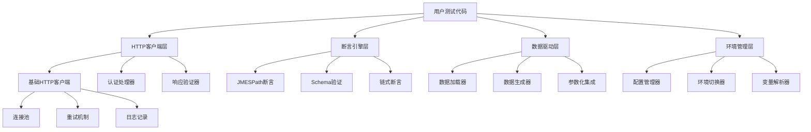
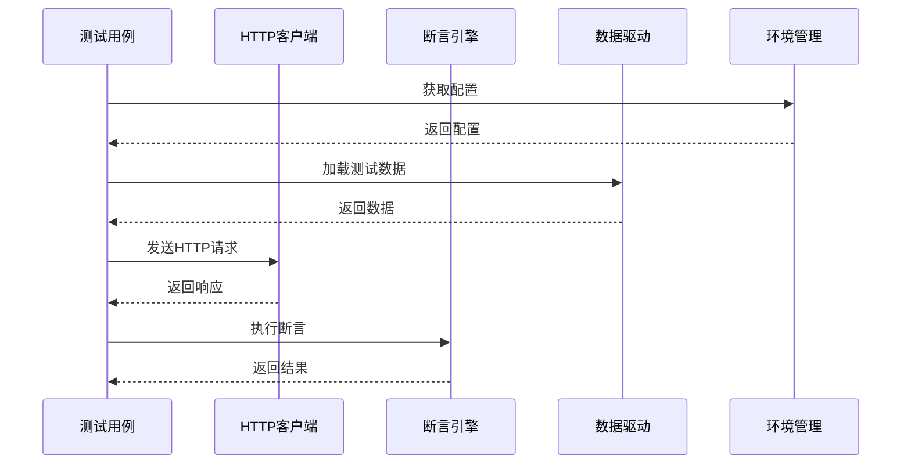
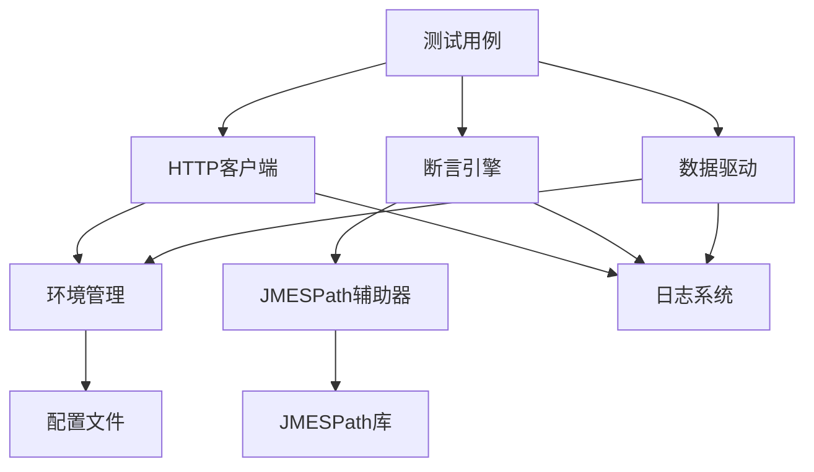

# 🧩 核心组件

本文档详细介绍 Pytest Framework 的各个核心组件，包括其设计理念、功能特性和使用方法。

## 📋 组件概览



## 🌐 HTTP客户端层

### 1. 基础HTTP客户端 (`src/client/base_client.py`)

**设计理念**: 提供简洁易用的HTTP接口，封装requests库的复杂性。

**核心特性**:
- 会话管理和连接复用
- 自动日志记录
- 自定义User-Agent
- 超时控制
- 错误处理

**使用示例**:
```python
from src.client.base_client import BaseClient

# 创建客户端
client = BaseClient("https://api.example.com", timeout=30)

# 发送请求
response = client.get("/users")
response = client.post("/users", json={"name": "张三"})
```

**内部实现**:
```python
class BaseClient:
    def __init__(self, host, timeout=10):
        self.host = host
        self.timeout = timeout
        self.session = Session()

        # 配置日志钩子
        if settings.get("logger_hook", True):
            self.session.hooks["response"].append(logger_hook)

        # 设置自定义User-Agent
        headers = self.session.headers
        origin_user_agent = headers.get("User-Agent", "")
        new_user_agent = CUSTOM_USER_AGENT.format(origin_user_agent)
        headers["User-Agent"] = new_user_agent
```

### 2. 认证处理器 (`src/client/base_auth.py`)

**设计理念**: 支持多种认证方式，可扩展的认证架构。

**支持的认证类型**:
- Bearer Token认证
- Basic认证
- API Key认证
- 自定义认证

**使用示例**:
```python
from src.client.base_auth import BearerAuth, BasicAuth

# Bearer Token认证
client.session.auth = BearerAuth("your-access-token")

# Basic认证
client.session.auth = BasicAuth("username", "password")
```

### 3. 响应验证器 (`src/client/validatable.py`)

**设计理念**: 提供响应数据的自动验证和转换功能。

**功能特性**:
- 响应状态码验证
- Content-Type检查
- JSON格式验证
- 自动数据转换

## 🔍 断言引擎层

### 1. JMESPath断言引擎 (`src/utils/assertion.py`)

**设计理念**: 基于JMESPath提供强大的JSON数据查询和断言能力。

**核心功能**:
- JMESPath路径查询
- 链式断言语法
- 类型检查
- 存在性验证

**使用示例**:
```python
from src.utils.assertion import assert_response

(assert_response(response_data)
 .assert_jmespath("code", 200)
 .assert_jmespath("data.user.name", "张三")
 .assert_jmespath_exists("data.user.email")
 .assert_jmespath_length("data.items", 5))
```

### 2. JMESPath辅助器 (`src/utils/jmespath_helper.py`)

**设计理念**: 提供JMESPath查询的便捷方法和常用模式。

**核心功能**:
- 查询结果缓存
- 错误处理
- 类型转换
- 常用模式

**使用示例**:
```python
from src.utils.jmespath_helper import jmes, CommonJMESPatterns

helper = jmes(response_data)

# 基础查询
user_name = helper.get_value("data.user.name")

# 条件过滤
active_users = helper.filter_by("data.users", "status == 'active'")

# 排序
sorted_users = helper.sort_by("data.users", "created_at")

# 使用常用模式
api_code = helper.get_value(CommonJMESPatterns.API_CODE)
```

### 3. Schema验证器

**设计理念**: 提供JSON Schema验证，确保API响应结构的正确性。

**功能特性**:
- JSON Schema验证
- 自定义验证规则
- 详细错误报告
- 性能优化

## 📊 数据驱动层

### 1. 数据加载器 (`src/utils/data_driver.py`)

**设计理念**: 支持多种数据源，统一的数据加载接口。

**支持的数据格式**:
- JSON文件
- YAML文件
- CSV文件
- Excel文件

**使用示例**:
```python
from src.utils.data_driver import data_driver, load_test_data

# 加载JSON数据
users = load_test_data("test_users.json")

# 加载Excel数据
test_cases = data_driver.load_excel("test_cases.xlsx", "用户测试")

# 加载YAML配置
config = data_driver.load_yaml("api_config.yaml")
```

### 2. 数据生成器

**设计理念**: 基于Faker库提供动态测试数据生成。

**功能特性**:
- 模板化数据生成
- 多语言支持
- 自定义生成器
- 数据关联

**使用示例**:
```python
# 定义数据模板
template = {
    "name": "faker.name",
    "email": "faker.email",
    "phone": "faker.phone_number",
    "address": "faker.address"
}

# 生成测试数据
test_data = data_driver.generate_test_data(template, count=10)
```

### 3. 参数化集成

**设计理念**: 与pytest参数化无缝集成，支持数据驱动测试。

**使用示例**:
```python
@pytest.mark.parametrize("user_data", load_test_data("users.json"))
def test_create_user(self, user_data):
    response = self.client.post("/users", json=user_data)
    assert response.status_code == 201
```

## 🌍 环境管理层

### 1. 配置管理器 (`src/utils/environment.py`)

**设计理念**: 基于Dynaconf提供灵活的配置管理。

**功能特性**:
- 多环境配置
- 配置继承
- 环境变量集成
- 配置验证

**配置结构**:
```yaml
# conf/settings.yaml
boe:  # 开发环境
  API:
    base_url: "https://dev-api.example.com"
    timeout: 30
  DB:
    host: "dev-db.example.com"
    port: 3306

test:  # 测试环境
  API:
    base_url: "https://test-api.example.com"
    timeout: 60
```

### 2. 环境切换器

**设计理念**: 运行时动态切换环境配置。

**使用示例**:
```python
from src.utils.environment import switch_environment, get_config

# 切换到测试环境
switch_environment("test")

# 获取配置
api_url = get_config("API.base_url")
timeout = get_config("API.timeout", 30)
```

## 🎭 Mock服务层

### 1. Mock服务器 (`src/utils/mock_server.py`)

**设计理念**: 轻量级HTTP Mock服务器，支持复杂的模拟场景。

**核心功能**:
- 规则匹配引擎
- 响应模拟
- 延迟模拟
- 调用统计

**使用示例**:
```python
from src.utils.mock_server import MockServer, create_mock_response

# 创建Mock服务器
mock_server = MockServer(port=8888)

# 添加Mock规则
mock_server.add_rule(
    "GET", "/api/users/123",
    create_mock_response(200, {"id": 123, "name": "张三"})
)

# 启动服务器
mock_server.start()
```

### 2. 规则匹配引擎

**设计理念**: 灵活的请求匹配机制，支持复杂的匹配条件。

**匹配条件**:
- HTTP方法
- URL路径
- 查询参数
- 请求头
- 请求体

## ⚡ 性能测试层

### 1. 性能测试器 (`src/utils/performance.py`)

**设计理念**: 提供负载测试和压力测试能力。

**功能特性**:
- 并发执行
- 性能指标收集
- 结果分析
- 报告生成

**使用示例**:
```python
from src.utils.performance import load_test

def api_request():
    return requests.get("https://api.example.com/users")

# 负载测试
metrics = load_test(
    api_request,
    concurrent_users=10,
    total_requests=100
)

print(f"平均响应时间: {metrics.avg_response_time}s")
print(f"QPS: {metrics.requests_per_second}")
```

### 2. 指标收集器

**设计理念**: 全面的性能指标收集和分析。

**收集的指标**:
- 响应时间（平均、最小、最大、百分位）
- 吞吐量（QPS）
- 错误率
- 并发性能

## 📝 日志系统

### 1. 日志管理器 (`src/utils/log_moudle.py`)

**设计理念**: 基于Loguru的结构化日志系统。

**功能特性**:
- 结构化日志
- 多级别日志
- 文件轮转
- 性能优化

**使用示例**:
```python
from src.utils.log_moudle import logger

logger.info("API请求开始", extra={
    "method": "POST",
    "url": "/api/users",
    "request_id": "req_123"
})
```

## 🔧 工具类库

### 1. 文件操作工具 (`src/utils/file_operation.py`)

**功能特性**:
- 文件压缩和解压
- 目录操作
- 文件监控
- 批量处理

### 2. 日期操作工具 (`src/utils/date_operation.py`)

**功能特性**:
- 日期格式化
- 时区处理
- 日期计算
- 相对时间

### 3. 字典工具 (`src/utils/dict_tools.py`)

**功能特性**:
- 深度合并
- 路径访问
- 类型转换
- 数据清洗

## 🔌 扩展机制

### 1. 插件系统

**设计理念**: 基于pytest插件机制的扩展架构。

**扩展点**:
- 自定义断言
- 自定义客户端
- 自定义数据源
- 自定义报告

### 2. Hook系统

**设计理念**: 事件驱动的Hook机制。

**可用Hook**:
- 测试前置处理
- 测试后置处理
- 请求前置处理
- 响应后置处理

## 📊 组件交互

### 1. 数据流



### 2. 依赖关系



## 🎯 设计原则

### 1. 单一职责原则
每个组件只负责一个特定的功能领域，保持组件的内聚性。

### 2. 开放封闭原则
组件对扩展开放，对修改封闭，通过接口和插件机制支持扩展。

### 3. 依赖倒置原则
高层模块不依赖低层模块，都依赖于抽象接口。

### 4. 接口隔离原则
使用多个专门的接口，而不是单一的总接口。

## 🚀 性能优化

### 1. 连接复用
HTTP客户端使用连接池，减少连接建立开销。

### 2. 缓存机制
配置和查询结果缓存，提升性能。

### 3. 异步支持
支持异步HTTP请求，提高并发性能。

### 4. 内存优化
大数据量处理时的内存优化策略。

---

**下一步**: [设计理念](./design-principles.md) | [扩展机制](./extension.md)
