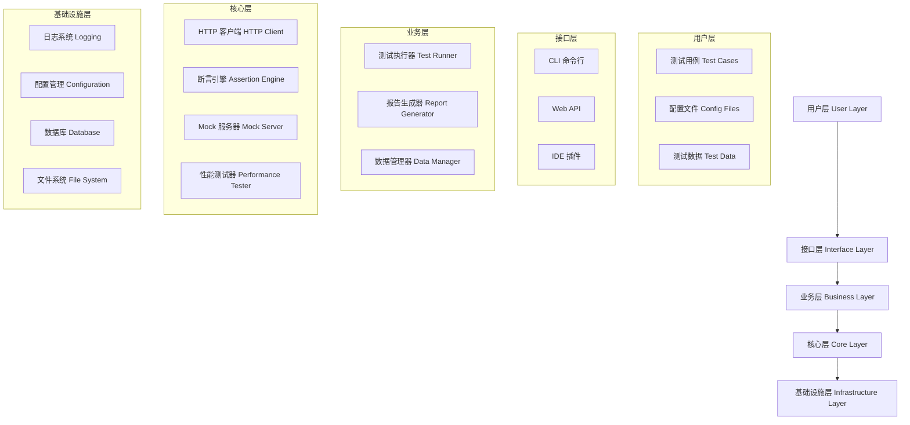
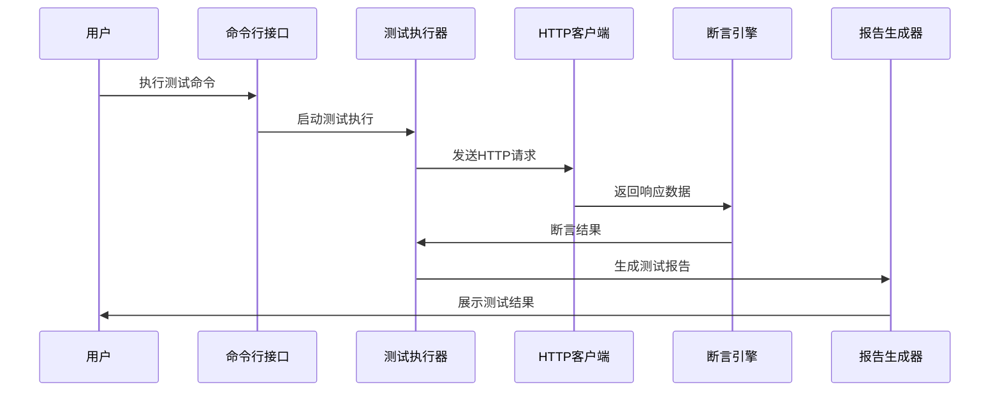

# 🏗️ 整体架构

Pytest Framework 是一个基于 Python + pytest 的现代化接口测试自动化框架，采用分层架构设计，具有高度的可扩展性和可维护性。

## 🎯 设计目标

- **易用性**: 简单直观的API，降低学习成本
- **可扩展性**: 模块化设计，支持插件扩展
- **可维护性**: 清晰的代码结构，良好的文档
- **高性能**: 支持并发执行和性能测试
- **企业级**: 满足企业级测试需求

## 🏛️ 架构层次



## 📦 核心模块

### 1. 配置管理模块 (conf/)

负责管理框架的配置信息，支持多环境配置。

```python
# 配置结构
conf/
├── config.py          # 配置管理器
├── constants.py       # 常量定义
├── settings.yaml      # 主配置文件
└── settings.local.yaml # 本地配置文件
```

**核心功能**:
- 多环境配置支持 (dev/test/prod)
- 动态配置加载
- 环境变量集成
- 配置验证

### 2. 核心组件模块 (src/)

框架的核心功能实现。

```python
src/
├── client/            # HTTP客户端
│   ├── base_client.py    # 基础HTTP客户端
│   ├── base_auth.py      # 认证处理
│   └── validatable.py   # 响应验证
├── model/             # 数据模型
│   ├── auto_pytest.py   # 测试相关模型
│   └── modelsbase.py    # 基础模型
└── utils/             # 工具类
    ├── assertion.py      # 增强断言
    ├── data_driver.py    # 数据驱动
    ├── environment.py    # 环境管理
    ├── mock_server.py    # Mock服务器
    ├── performance.py    # 性能测试
    └── log_moudle.py     # 日志管理
```

### 3. 测试用例模块 (tests/)

测试用例的组织和管理。

```python
tests/
├── conftest.py        # pytest配置
├── examples/          # 示例测试
├── test_user/         # 用户模块测试
└── test_goods/        # 商品模块测试
```

## 🔄 数据流



## 🧩 组件交互

### 1. 配置驱动

所有组件都通过配置管理器获取配置信息：

```python
from src.utils.environment import get_config, get_base_url

# 获取API配置
base_url = get_base_url("user_service")
timeout = get_config("API.timeout", 30)

# 创建客户端
client = BaseClient(base_url, timeout=timeout)
```

### 2. 插件机制

框架支持通过插件扩展功能：

```python
# pytest插件注册
def pytest_configure(config):
    """注册自定义插件"""
    config.pluginmanager.register(CustomPlugin())

# 自定义Hook
def pytest_runtest_setup(item):
    """测试前置处理"""
    setup_test_environment(item)
```

### 3. 事件驱动

组件间通过事件进行解耦通信：

```python
from src.utils.events import EventBus

# 发布事件
EventBus.publish("test_started", test_info)

# 订阅事件
@EventBus.subscribe("test_completed")
def handle_test_completed(test_result):
    generate_report(test_result)
```

## 🔧 扩展点

框架提供多个扩展点，支持自定义功能：

### 1. 自定义断言

```python
from src.utils.assertion import EnhancedAssertion

class CustomAssertion(EnhancedAssertion):
    def assert_business_rule(self, data):
        """自定义业务规则断言"""
        # 实现自定义断言逻辑
        pass
```

### 2. 自定义客户端

```python
from src.client.base_client import BaseClient

class CustomClient(BaseClient):
    def __init__(self, host, **kwargs):
        super().__init__(host, **kwargs)
        # 添加自定义功能
```

### 3. 自定义数据源

```python
from src.utils.data_driver import DataDriver

class CustomDataDriver(DataDriver):
    def load_from_database(self, query):
        """从数据库加载测试数据"""
        # 实现数据库数据加载
        pass
```

## 📊 性能特性

### 1. 并发执行

```python
# pytest-xdist 并发执行
pytest -n auto  # 自动检测CPU核心数
pytest -n 4     # 指定4个进程
```

### 2. 异步支持

```python
import asyncio
from src.client.async_client import AsyncClient

async def test_async_api():
    client = AsyncClient("https://api.example.com")
    response = await client.get("/users")
    assert response.status_code == 200
```

### 3. 连接池

```python
# HTTP连接池配置
client = BaseClient(
    host="https://api.example.com",
    pool_connections=10,
    pool_maxsize=20
)
```

## 🛡️ 安全特性

### 1. 认证支持

```python
from src.client.base_auth import BearerAuth, BasicAuth

# Bearer Token认证
client.session.auth = BearerAuth("your-token")

# Basic认证
client.session.auth = BasicAuth("username", "password")
```

### 2. 敏感数据保护

```python
# 配置文件中的敏感数据
# .secrets.yaml (不提交到版本控制)
production:
  DB:
    password: "encrypted_password"
  API:
    secret_key: "encrypted_secret"
```

## 📈 监控和观测

### 1. 日志系统

```python
from src.utils.log_moudle import logger

# 结构化日志
logger.info("API请求开始", extra={
    "method": "POST",
    "url": "/api/users",
    "request_id": "req_123"
})
```

### 2. 指标收集

```python
from src.utils.metrics import MetricsCollector

# 收集性能指标
metrics = MetricsCollector()
metrics.record_response_time("api_call", 0.5)
metrics.increment_counter("api_success")
```

## 🔮 未来规划

### 短期目标 (1-3个月)
- [ ] GraphQL支持
- [ ] WebSocket测试
- [ ] 更多数据源支持
- [ ] 可视化测试编辑器

### 中期目标 (3-6个月)
- [ ] 分布式测试执行
- [ ] AI辅助测试生成
- [ ] 实时监控面板
- [ ] 云原生部署

### 长期目标 (6-12个月)
- [ ] 多语言SDK
- [ ] 企业级权限管理
- [ ] 测试资产市场
- [ ] 智能测试推荐

---

**下一步**: [核心组件](./components.md) | [设计理念](./design-principles.md) | [扩展机制](./extension.md)
