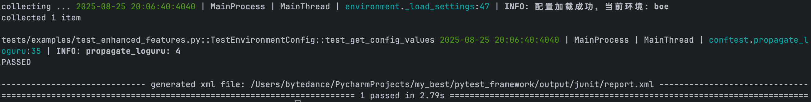
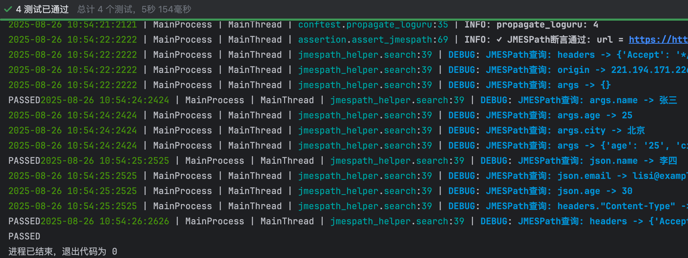

# 🚀 快速开始指南

欢迎使用 Pytest Framework！这个指南将帮助您在5分钟内快速上手，开始编写您的第一个接口测试。

## 📋 前置要求

在开始之前，请确保您的系统满足以下要求：

- **Python**: 3.8 或更高版本
- **操作系统**: Windows、macOS 或 Linux
- **内存**: 至少 2GB RAM
- **磁盘空间**: 至少 500MB 可用空间

## ⚡ 快速安装

### 1. 克隆项目

```bash
git clone https://github.com/ljxpython/pytest_framework.git
cd pytest_framework
```

### 2. 安装依赖

使用 Poetry（推荐）：
```bash
poetry install
poetry shell
```

或使用 pip：
```bash
pip install -r requirements.txt
```

### 3. 验证安装

```bash
pytest --version
python -m pytest tests/examples/test_enhanced_features.py::TestEnvironmentConfig::test_get_config_values -v
```



如果看到测试通过，说明安装成功！

## 🎯 5分钟快速体验

### 步骤1: 配置环境

编辑 `conf/settings.yaml` 文件：

```yaml
boe:  # 开发环境
  API:
    base_url: "https://httpbin.org"
    timeout: 30

  DEBUG: true
  LOG_LEVEL: "INFO"
```

### 步骤2: 编写第一个测试

创建文件 `tests/my_first_test.py`：

```python
import pytest
from src.client.base_client import BaseClient
from src.utils.assertion import assert_success_response
from src.utils.environment import get_base_url

class TestMyFirstAPI:
    """我的第一个API测试"""

    def setup_method(self):
        """测试前置设置"""
        base_url = get_base_url()
        self.client = BaseClient(base_url)

    def test_get_request(self):
        """测试GET请求"""
        response = self.client.get("/get?name=张三&age=25")

        # 使用增强断言验证响应
        (assert_success_response(response)
         .assert_json_path("$.args.name", "张三")
         .assert_json_path("$.args.age", "25"))

    def test_post_request(self):
        """测试POST请求"""
        user_data = {
            "name": "李四",
            "email": "lisi@example.com",
            "age": 30
        }

        response = self.client.post("/post", json=user_data)

        # 验证响应
        (assert_success_response(response)
         .assert_json_path("$.json.name", "李四")
         .assert_json_path("$.json.email", "lisi@example.com")
         .assert_contains("application/json", response.headers.get("Content-Type")))
```

### 步骤3: 运行测试

```bash
# 运行单个测试文件
pytest tests/my_first_test.py -v

# 运行所有测试
pytest -v

# 生成Allure报告
pytest --alluredir=output/allure-result
allure generate output/allure-result -o output/allure-report --clean
```




### 步骤4: 查看测试报告

打开 `output/allure-report/index.html` 查看详细的测试报告。

## 🌟 核心特性预览

### 1. 增强断言

```python
from src.utils.assertion import assert_response

# 链式断言
(assert_response(response_data)
 .assert_status_code(200, response.status_code)
 .assert_json_path("$.data.user.name", "张三")
 .assert_jmespath("users[?age > `25`].name | [0]", "李四")
 .assert_contains("success", response_data))
```

### 2. 数据驱动测试

```python
from src.utils.data_driver import data_driver

# 生成测试数据
template = {
    "name": "faker.name",
    "email": "faker.email",
    "phone": "faker.phone_number"
}
test_data = data_driver.generate_test_data(template, count=5)

# 参数化测试
@pytest.mark.parametrize("user_data", test_data)
def test_create_user(self, user_data):
    response = self.client.post("/users", json=user_data)
    assert_success_response(response, 201)
```

### 3. Mock服务器

```python
from src.utils.mock_server import MockServer, create_mock_response

# 启动Mock服务器
mock_server = MockServer(port=8888)
mock_server.add_rule(
    "GET", "/api/users/123",
    create_mock_response(200, {"id": 123, "name": "张三"})
)
mock_server.start()
```

### 4. 性能测试

```python
from src.utils.performance import load_test

def api_request():
    return requests.get("https://httpbin.org/delay/0.1")

# 负载测试
metrics = load_test(api_request, concurrent_users=10, total_requests=100)
print(f"平均响应时间: {metrics.avg_response_time}s")
print(f"QPS: {metrics.requests_per_second}")
```

## 📁 项目结构

```
pytest-framework/
├── conf/                   # 配置文件
│   ├── config.py          # 配置管理
│   └── settings.yaml      # 环境配置
├── src/                   # 核心源码
│   ├── client/           # HTTP客户端
│   ├── model/            # 数据模型
│   └── utils/            # 工具类
├── tests/                # 测试用例
│   ├── examples/         # 示例测试
│   └── conftest.py       # pytest配置
├── docs/                 # 文档
├── output/               # 测试输出
└── main.py              # 主入口
```

## 🎯 下一步

恭喜！您已经成功运行了第一个测试。接下来您可以：

1. 📖 阅读 [基础用法指南](../user-guide/basic-usage.md) 了解更多功能
2. 🏗️ 查看 [架构设计](../architecture/overview.md) 理解框架原理
3. 💡 学习 [最佳实践](../best-practices/test-organization.md) 编写高质量测试
4. 🔧 探索 [高级特性](../user-guide/advanced-features.md) 提升测试效率

## ❓ 遇到问题？

如果在快速开始过程中遇到任何问题：

- 📖 查看 [常见问题](../faq/README.md)
- 🔧 参考 [故障排除指南](../faq/troubleshooting.md)
- 💬 在 GitHub 上提交 Issue
- 📧 发送邮件寻求帮助

---

**下一步**: [安装指南](./installation.md) | [第一个测试](./first-test.md)
